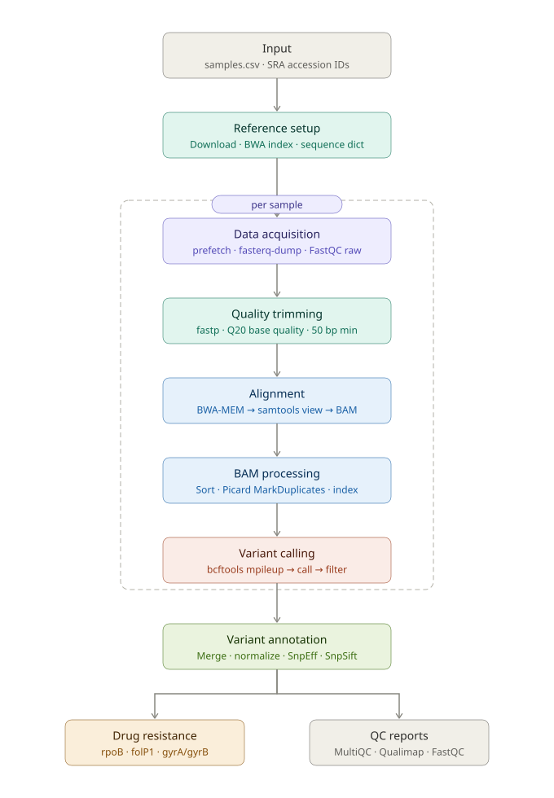

# 🧬 M. leprae NGS Analysis Pipeline v2.0

> Complete pipeline for analyzing *Mycobacterium leprae* genomic data with automated drug resistance detection.

---

## 📋 Table of Contents

- [Overview](#overview)
- [Key Features](#key-features)
- [Pipeline Workflow](#pipeline-workflow)
- [Requirements](#requirements)
- [Quick Start](#quick-start)
- [Directory Structure](#directory-structure)
- [Drug Resistance Analysis](#drug-resistance-analysis)
- [Resume Capability](#resume-capability)
- [Quality Control](#quality-control)
- [Configuration Options](#configuration-options)
- [Logging](#logging)
- [Common Issues](#common-issues)
- [Interpretation of Results](#interpretation-of-results)
- [References](#references)
- [License](#license)

---

## Overview

This pipeline automates the complete workflow for *M. leprae* whole-genome sequencing analysis — from raw SRA data download through variant calling, annotation, and drug resistance screening. It is designed for research use at CSIR-IHBT and follows WHO guidelines for leprosy drug resistance interpretation.

---

## 🎯 Key Features

### New in Version 2.0

| Feature | Description |
|---------|-------------|
| ✅ Robust Error Handling | Automatic detection, logging, and clean exit on failure |
| ✅ Resume Capability | Picks up from the last successful step after interruption |
| ✅ Drug Resistance Analysis | Screens rpoB, folP1, gyrA, gyrB for known resistance mutations |
| ✅ Comprehensive QC | FastQC, fastp, Qualimap, and MultiQC reports at every stage |
| ✅ Configurable | External config file — no need to edit the main script |
| ✅ Monitoring Tool | Interactive script for status, logs, and diagnostics |

### Bug Fixes from v1.0

- ✅ Fixed **missing BAM indexing** — pipeline no longer crashes before variant calling
- ✅ Fixed **reference genome path** in normalization step
- ✅ Added **`set -euo pipefail`** — fails fast instead of silently continuing
- ✅ Added **input validation** — clear errors for missing/malformed sample files
- ✅ Added **sequence dictionary** creation for Picard compatibility

---

## 🔬 Pipeline Workflow



```
┌─────────────────────────────────────────────────────────┐
│                     INPUT: samples.csv                  │
│                   (SRA accession IDs)                   │
└────────────────────────┬────────────────────────────────┘
                         │
                         ▼
┌─────────────────────────────────────────────────────────┐
│  SETUP                                                  │
│  ├── Download reference genome (GCF_000195855.1)        │
│  ├── BWA index + samtools faidx                         │
│  └── Picard CreateSequenceDictionary                    │
└────────────────────────┬────────────────────────────────┘
                         │
          ┌──────────────┴──────────────┐
          │   Per-sample processing     │
          │                             │
          ▼                             ▼
   SINGLE-END                      PAIRED-END
   prefetch + fasterq-dump         prefetch + fasterq-dump
          │                             │
          └──────────────┬──────────────┘
                         │
                         ▼
              ┌──────────────────────┐
              │  FastQC (raw reads)  │
              └──────────┬───────────┘
                         │
                         ▼
              ┌──────────────────────┐
              │  fastp trimming      │
              │  (quality + length)  │
              └──────────┬───────────┘
                         │
                         ▼
              ┌──────────────────────┐
              │  BWA-MEM alignment   │
              │  → samtools BAM      │
              └──────────┬───────────┘
                         │
                         ▼
              ┌──────────────────────┐
              │  samtools sort       │
              └──────────┬───────────┘
                         │
                         ▼
              ┌──────────────────────┐
              │ Picard MarkDuplicates│
              └──────────┬───────────┘
                         │
                         ▼
              ┌──────────────────────┐
              │  samtools index      │  ← (was missing in v1.0!)
              └──────────┬───────────┘
                         │
                         ▼
              ┌──────────────────────┐
              │  bcftools mpileup    │
              │  bcftools call       │
              │  bcftools filter     │
              └──────────┬───────────┘
                         │
          ┌──────────────┴──────────────────────────┐
          │                                         │
          ▼                                         ▼
┌─────────────────────┐              ┌───────────────────────────┐
│  bcftools merge     │              │  MultiQC / Qualimap       │
│  bcftools norm      │              │  QC reports               │
│  SnpEff annotate    │              └───────────────────────────┘
│  SnpSift extract    │
└──────────┬──────────┘
           │
           ▼
┌──────────────────────────────────┐
│  Drug Resistance Analysis        │
│  ├── rpoB   → Rifampicin         │
│  ├── folP1  → Dapsone            │
│  └── gyrA/B → Fluoroquinolones   │
└──────────────────────────────────┘
           │
           ▼
┌──────────────────────────────────┐
│  OUTPUT                          │
│  ├── Annotated VCF               │
│  ├── Genotype matrix             │
│  ├── Resistance report           │
│  └── QC HTML reports             │
└──────────────────────────────────┘
```

---

## 📋 Requirements

### Software Dependencies

```bash
# SRA toolkit
prefetch, fasterq-dump

# Quality control
fastqc, fastp, multiqc, qualimap

# Alignment
bwa, samtools (>= 1.10)

# Variant calling
bcftools, picard

# Annotation
snpEff, SnpSift

# Utilities
curl, unzip, pigz, bgzip, tabix, python3 (>= 3.9)
```

### Installation (Conda — recommended)

```bash
conda create -n mleprae_pipeline -c bioconda -c conda-forge \
    sra-tools fastqc fastp bwa samtools bcftools picard \
    snpeff snpsift qualimap multiqc pigz python=3.11

conda activate mleprae_pipeline
```

### System Requirements

| Resource | Minimum | Recommended |
|----------|---------|-------------|
| CPU cores | 4 | 8–16 |
| RAM | 8 GB | 16–32 GB |
| Disk space | 50 GB | 200+ GB |
| OS | Linux | Ubuntu 20.04 / 22.04 |

---

## 🚀 Quick Start

### 1. Clone the repository

```bash
git clone https://github.com/YOUR_USERNAME/mleprae-ngs-pipeline.git
cd mleprae-ngs-pipeline
```

### 2. Make scripts executable

```bash
chmod +x vcf_pipeline_improved.sh pipeline_monitor.sh setup.sh
chmod +x analyze_drug_resistance.py
```

### 3. Run setup check

```bash
./setup.sh
```

This verifies dependencies, creates your config template, and optionally downloads the reference genome.

### 4. Prepare your sample list

Edit `sample_list_template.csv` with your SRA accession numbers:

```csv
sra_id,type
SRR1234567,PAIRED
SRR1234568,SINGLE
SRR1234569,PAIRED
```

`type` must be `SINGLE` or `PAIRED` (case-sensitive).

### 5. Run the pipeline

```bash
# Optional: load custom config first
source my_config.sh

# Run
./vcf_pipeline_improved.sh my_samples.csv
```

### 6. Monitor progress

```bash
# Interactive menu
./pipeline_monitor.sh

# Or quick checks
./pipeline_monitor.sh --progress
./pipeline_monitor.sh --errors
./pipeline_monitor.sh --results
```

---

## 📁 Directory Structure

After a complete run:

```
.
├── fastq/
│   ├── rawdata/              # Downloaded raw FASTQ files
│   └── trimmed/              # Quality-trimmed reads
├── index/                    # Reference genome + BWA/samtools indices
├── results/
│   ├── aligned_bam/          # Raw aligned reads (.bam)
│   ├── sorted_bam/           # Coordinate-sorted BAMs
│   ├── dedup_bam/            # Deduplicated BAMs
│   ├── pileup/               # BCF pileup files
│   ├── variant_vcf/          # Raw variant calls
│   ├── filtered_vcf/         # Quality-filtered variants (.vcf.gz)
│   ├── annotation/           # SnpEff-annotated VCFs + genotype matrix
│   └── drug_resistance/      # Resistance analysis outputs
├── reports/
│   ├── fastqc_raw/           # Pre-trimming QC
│   ├── fastqc_trimmed/       # Post-trimming QC
│   ├── qualimap/             # Alignment QC
│   └── complete_pipeline_report.html  # Overall MultiQC report
└── logs/
    ├── pipeline_YYYYMMDD_HHMMSS.log   # Full pipeline log
    └── error_YYYYMMDD_HHMMSS.log      # Errors only
```

---

## 🔬 Drug Resistance Analysis

### Automatically screened genes

#### Rifampicin Resistance — `rpoB`
| Mutation | Resistance Level |
|----------|----------------|
| S425L, S425F | High |
| D441Y, D441V | High |
| H451Y, H451D | High |
| S456L | High |
| Q432R, Q432K | Moderate |

#### Dapsone Resistance — `folP1`
| Mutation | Resistance Level |
|----------|----------------|
| T53I, T53A | High |
| P55L, P55R, P55S | High |
| P55T | Moderate |

#### Fluoroquinolone Resistance — `gyrA` / `gyrB`
| Mutation | Resistance Level |
|----------|----------------|
| A91V, A91T | High |
| D95N, D95Y, D95G | High |
| R447C, G447D (gyrB) | Moderate |

### Output files

| File | Description |
|------|-------------|
| `results/drug_resistance/resistance_mutations.tsv` | Full tab-separated mutation table |
| `results/drug_resistance/resistance_summary.txt` | Human-readable report with interpretation |
| `results/drug_resistance/resistance_genes.vcf` | VCF subset containing only resistance-gene variants |

### Standalone analysis (custom VCF)

```bash
python3 analyze_drug_resistance.py \
    results/annotation/norm_annotate.vcf \
    -o custom_resistance.tsv \
    -r custom_report.txt
```

---

## 🔄 Resume Capability

If the pipeline is interrupted for any reason:

```bash
# Simply re-run — it resumes from the last successful step
./vcf_pipeline_improved.sh samples.csv

# To force a fresh start
rm .pipeline_resume
./vcf_pipeline_improved.sh samples.csv
```

Checkpoint state is stored in `.pipeline_resume`. Each completed step is recorded so no work is duplicated.

---

## 📊 Quality Control

The pipeline produces QC reports at four stages:

| Stage | Location | Tool |
|-------|----------|------|
| Raw reads | `reports/fastqc_raw/` | FastQC |
| Trimmed reads | `reports/fastqc_trimmed/` | FastQC + fastp HTML |
| Alignment | `reports/qualimap/` | Qualimap |
| Full pipeline | `reports/complete_pipeline_report.html` | MultiQC |

---

## ⚙️ Configuration Options

Copy `pipeline_config.sh` and edit to suit your system:

```bash
cp pipeline_config.sh my_config.sh
nano my_config.sh
source my_config.sh
```

### Available parameters

```bash
# Performance
export THREADS=8                 # CPU threads (general)
export SAMTOOLS_THREADS=4        # Threads for samtools

# Quality filters
export MIN_QUALITY=20            # Minimum base quality (fastp)
export MIN_LENGTH=50             # Minimum read length after trimming
export MIN_MQ=30                 # Minimum mapping quality (bcftools filter)
export MIN_DP=5                  # Minimum read depth
export MIN_AD=3                  # Minimum alternate allele depth

# Behaviour
export CLEAN_RESUME=false        # true = ignore previous checkpoints
export KEEP_INTERMEDIATE=false   # true = keep unsorted/unfiltered BAMs
export SEND_EMAIL=false          # true = email on completion (requires mailx)
export EMAIL_ADDRESS=""
```

---

## 📝 Logging

All activity is logged automatically:

```
logs/pipeline_YYYYMMDD_HHMMSS.log   # Full timestamped log
logs/error_YYYYMMDD_HHMMSS.log      # Errors only
```

Useful commands:

```bash
# Follow live progress
tail -f logs/pipeline_*.log

# Search for errors
grep "ERROR" logs/pipeline_*.log

# View latest error log
cat $(ls -t logs/error_*.log | head -1)
```

---

## 🛠️ Common Issues and Solutions

### "Command not found"

Ensure all dependencies are installed and the conda environment is active:

```bash
conda activate mleprae_pipeline
command -v bwa && echo "OK" || echo "MISSING"
command -v samtools && echo "OK" || echo "MISSING"
```

### "Reference genome download fails"

Download manually and place in `index/`:

```bash
curl -L "https://ftp.ncbi.nlm.nih.gov/genomes/all/GCF/000/195/855/GCF_000195855.1_ASM19585v1/GCF_000195855.1_ASM19585v1_genomic.fna.gz" \
    -o index/GCF_000195855.1_ASM19585v1_genomic.fna.gz
gunzip index/GCF_000195855.1_ASM19585v1_genomic.fna.gz
```

### "Out of memory"

Reduce thread count in your config:

```bash
export THREADS=2
export SAMTOOLS_THREADS=1
```

### "Pipeline stops unexpectedly"

```bash
# Check what failed
cat $(ls -t logs/error_*.log | head -1)

# Then simply resume
./vcf_pipeline_improved.sh samples.csv
```

### Full system diagnostic

```bash
./pipeline_monitor.sh --check-all
```

---

## 🔍 Interpretation of Results

### Variant filtering criteria

Variants passing filters must satisfy **all** of:

| Filter | Threshold |
|--------|-----------|
| Mapping Quality (MQ) | > 30 |
| Total Read Depth (DP) | > 5 |
| Alternate Allele Depth (AD) | > 3 |

### Drug resistance levels

| Level | Meaning |
|-------|---------|
| **HIGH** | Strong evidence — treatment likely to fail |
| **MODERATE** | Possible resistance — use with caution |
| **LOW** | Limited evidence — clinical significance uncertain |

### Clinical recommendations

If HIGH-level resistance mutations are detected:

1. Consult WHO MDT guidelines for *M. leprae* treatment
2. Consider alternative drug regimens
3. Perform phenotypic drug susceptibility testing where possible
4. Monitor treatment response closely

---

## 📚 References

1. WHO Guidelines for the Diagnosis, Treatment and Prevention of Leprosy (2018)
2. Benjak et al. (2018) — Phylogenomics and antimicrobial resistance of *M. leprae*. *Nature Communications*
3. Cambau & Drancourt (2014) — Steps towards laboratory diagnosis of leprosy drug resistance. *Leprosy Review*
4. Matsuoka et al. (2007) — Drug-resistant *Mycobacterium leprae*. *Japanese Journal of Infectious Diseases*

---

## 📄 License

This pipeline is provided as-is for **research purposes only**. Consult appropriate regulatory bodies before any clinical use.

---

## 🙏 Acknowledgments

- [NCBI](https://www.ncbi.nlm.nih.gov/) — reference genomes and SRA
- [SnpEff / SnpSift](https://pcingola.github.io/SnpEff/) — variant annotation
- [Bioconda](https://bioconda.github.io/) — bioinformatics package management
- [WHO Leprosy Programme](https://www.who.int/teams/control-of-neglected-tropical-diseases/leprosy)

---

<div align="center">

**Version 2.0** &nbsp;|&nbsp; **Updated: 2024** &nbsp;|&nbsp; **CSIR-IHBT, Studio of Computational Biology & Bioinformatics**

</div>
